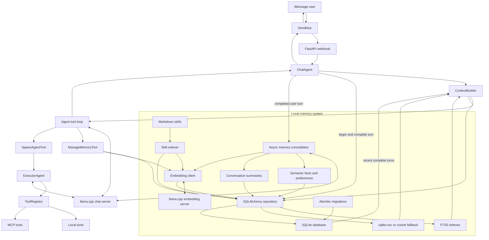

# Agent architecture

## Runtime flow

1. Sendblue delivers an inbound iMessage to the FastAPI webhook.
2. `ChatAgent` loads recent complete turns and retrieves relevant per-phone
   memories, summaries, and shared skills.
3. `ContextBuilder` combines FTS5 and vector results under bounded context
   budgets.
4. The chat model replies directly or delegates to `ExecutorAgent`, which gets
   only the selected context and tools needed for the task.
5. The complete turn—including tool calls and results—is committed atomically
   to SQLite.
6. The background consolidator extracts durable user facts, periodically
   summarizes conversations, and indexes both with local embeddings.

## Memory boundaries

- The normalized phone number identifies the private memory owner.
- One turn contains one inbound message and its full assistant/tool response.
- Conversation history, semantic facts, embeddings, summaries, and skill
  metadata persist in `.data/baka.db`.
- Shared procedural skills are authored in `skills/<name>/SKILL.md`.
- If the embedding server or `sqlite-vec` is unavailable, retrieval falls back
  to FTS5 or portable cosine ranking without interrupting chat.
